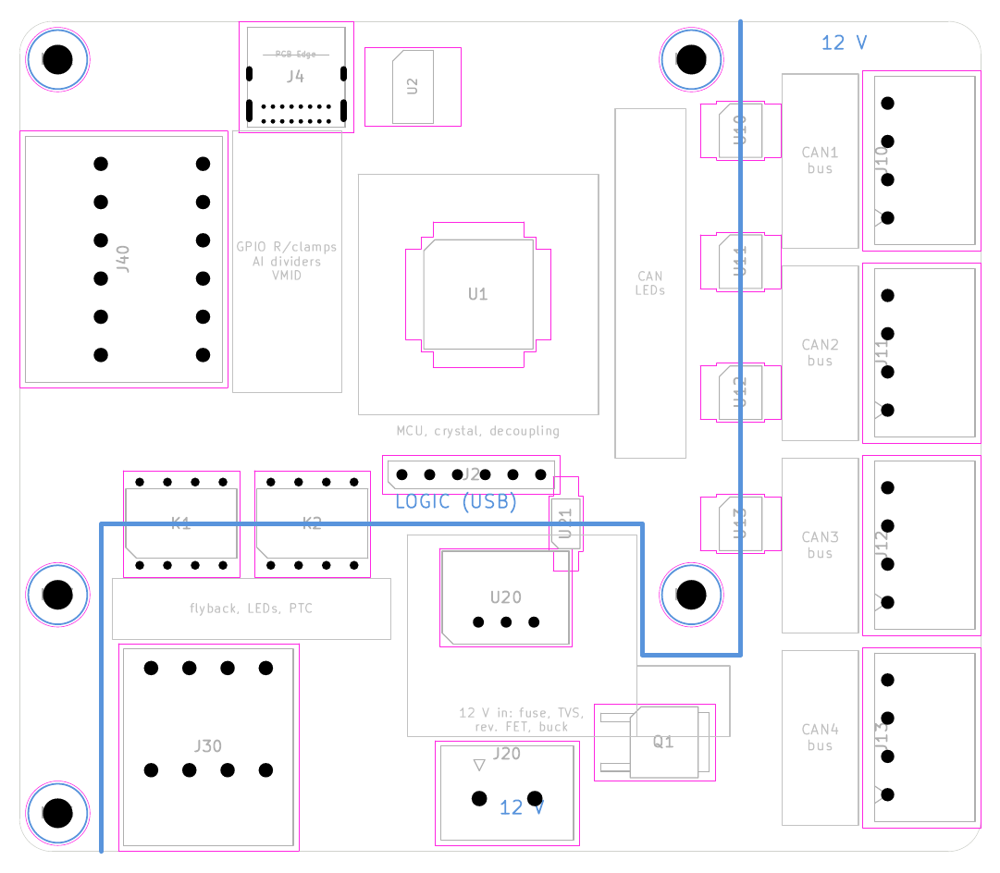

# CAN Controller

Primary controller for the ThlHats HASS stack: four isolated CAN FD buses and
relay drive (the gaps the MCC HATs leave), plus a couple of GPIO and
high-voltage analog inputs so one card covers small jobs. Requirements:
[`docs/requirements.md`](../../docs/requirements.md), section 4.1.

- Board: 88 x 76 mm, 2 layers, rev A
- Mounting: 4x M2.5 on the Raspberry Pi 58 x 49 mm pattern
- No Pi header connector (2026-10-06): logic powered from USB VBUS. The Pi
  hole pattern stays, so it can sit on top of a Pi/MCC stack on standoffs.
- MCU: PIC32MK1024MCM064-I/PT
- Host link: USB (gs_usb for CAN, plus a control interface)

## Scope reduction (2026-10-06)

The rev 3 design (8 GPIO, 8 relays through ISO6740 isolators, a ULN2803A and
an MCP23008 expander, 4 AI on an MCP3428, 2 x 0-10 V AO with DAC, reference,
LM358B and a 13 V boost) had grown past the board's purpose. Cut: analog out
(MCC 152 / can-ssr cover it), the expander, the isolators and ULN, 24 V-tolerant
GPIO, and half of the GPIO, relay and AI channels. The schematic, placement and
routing below that line are superseded and will be redone; `gen_schematic.py`,
`place_board.py` and `place_rev3.py` describe the old scope.

## Functional blocks

| Block | Baseline parts | Domain |
|-------|----------------|--------|
| MCU, USB | PIC32MK1024MCM064, USB-C receptacle (USB 2.0 FS device) | logic |
| CAN x4 (FD) | ISO1044BD, termination jumpers, 4-pin terminals (CANH, CANL, GND, +12 V) | crosses logic / 12 V |
| 12 V input | Keyed terminal, reverse polarity, TVS, fuse; per-bus fuse; buck to 5 V for ISO1044 bus sides | 12 V |
| 12 V status | Optocoupler from the 12 V rail to an MCU input (reports CAN bus power present) | crosses 12 V / logic |
| GPIO x4 | PIC32 pins directly, 3.3 V, series R + ESD clamp, ground terminal per pin | logic |
| Relay drive x4 | PhotoMOS per output (LED from a PIC32 pin), sources +12 V to a 12 V coil; flyback diode, LED, shared PTC | crosses logic / 12 V |
| Analog in x2 | +-116 V bipolar, 10M / 130k dividers to VMID (PIC32 op amp follower), PIC32 12-bit ADC, ground terminal per input | logic |

## Parts (draft, 2026-10-06)

| Function | Part | Package | Notes |
|---|---|---|---|
| MCU | PIC32MK1024MCM064-I/PT | TQFP-64 0.5 mm | 4 x CAN FD, USB FS, ADC, op amps |
| Crystal | 12 MHz, CL 18 pF | 5032 SMD | MPN TBD; USB clock from the UPLL |
| 3.3 V | MCP1826S-3302E/DB | SOT-223 | from USB VBUS |
| USB-C | GCT USB4085-GF-A | THT | 5.1k CC pull-downs; VBUS powers the logic through a PTC (bus-powered device, about 150 mA) |
| USB ESD | USBLC6-2SC6 | SOT-23-6 | |
| CAN transceiver x4 | ISO1044BD | SOIC-8 | CAN FD, 3 kVrms basic isolation |
| CAN TVS x4 | NUP2105L | SOT-23 | |
| CAN termination x4 | 120R 1206 + 2-pin jumper | | |
| CAN bus supply | PTC 1812, hold ~1.1 A | 1812 | fitted on CAN1 only (can-ssr bus); DNP on CAN2-4 |
| Relay x4 | 2 x dual PhotoMOS, e.g. Panasonic AQW212 (2 Form A) | DIP-8 | MPN to confirm: coil current, on-resistance, isolation, current-limit option |
| Relay flyback x4 | 1N4148W / S1G class | SOD-123 / SMA | OUTn to 0 V |
| Relay feed | PTC | 1812 | shared by the 4 outputs |
| 12 V input | MSTBVA 2,5/2-G-5,08, fuse, P-FET reverse polarity, SMBJ15A TVS | | |
| 12 V to 5 V | RECOM R-78E5.0-0.5 | SIP-3 | ISO1044 bus sides |
| 12 V status | TLP293 | SO-4 | |
| GPIO x4 | series R 1206 + ESD clamp | | 3.3 V only |
| AI dividers x2 | 10M + 130k 1206, 0.1 uF, BAT54S clamp | | 10M needs a voltage-rated 1206 (or two in series) |
| VMID | 3.3 V divider + PIC32MK op amp follower | | also sampled by the ADC |
| Connectors | MC 1,5/4-G-3,5 (CAN); SPTD double-level push-in (relay, GPIO, AI) | THT | |
| LEDs | 1206 | | power, heartbeat, USB, CAN x4, relay x4, 12 V |

## Floorplan (rev 4, 2026-10-06)

`hardware/floorplan_rev4.py OUT_DIR` draws it (real footprints for the edge
connectors and large parts, Dwgs.User block areas, Cmts.User domain boundary)
into a scratch board and renders the PNG; the placement script will reuse its
coordinates. Board corner at (100, 100) mm; coordinates below are from the corner.

| Edge | Connector | Position | Domain |
|------|-----------|----------|--------|
| Right | CAN1-CAN4 (J10-J13), MC 1,5/4-G-3,5 | y 4.5-74, full edge | 12 V |
| Bottom | RELAY (J30), SPTD 2x4: OUT1-4 / 0 V | x 9-25.6 | 12 V |
| Bottom | 12 V IN (J20), MSTBVA 2,5/2-G-5,08, top entry | x 38-51 | 12 V |
| Left | I/O (J40), SPTD 2x6: GPIO1-4, AI1-2 / GND | y 10-33.6, between MH1 and MH3 | logic |
| Top | USB-C (J4), USB4085 | x 20-30 | logic |

- 88 x 76 mm (6,690 mm2, a third less than rev 3). Height is set by the four
  CAN connectors on the right edge (4 x 17.6 mm). Parts courtyard about
  4,300 mm2, about 64 % coverage, with the logic side the sparser (room for
  the MCU to fan out).
- Holes: MH1-MH4 on the Pi pattern, all in the logic domain; MH5 at the
  bottom-left corner. No hole at the top or bottom right: the CAN strip uses
  the whole right edge.
- 12 V domain: the strip x > 66 mm plus the bottom block y > 46 mm (x > 7.5 mm),
  with a logic notch around MH4 (x 57-66, y 46-58). Crossings: the four
  ISO1044s on x = 66 at y 10/22/34/46 (all above MH4; CAN4's bus traces run
  down the strip), the two PhotoMOS and the TLP293 on y = 46.
- MCU centred at (42, 25): CAN pins face the isolators, GPIO/AI pins face J40,
  USB and the LDO above it. CAN activity LEDs on the logic side of the
  isolators. ICSP header J2 below the MCU.
- PhotoMOS LED pins on the logic side; flyback diodes, relay LEDs and the
  relay PTC between the PhotoMOS and J30.

## Layout rules

- Connectors on any edge (no Pi header since 2026-10-06).
- Split copper between the logic and 12 V domains; only the isolators cross.

## Directories

- `hardware/` KiCad project
- `firmware/` firmware sources

## Superseded: floorplan (rev 2, variant B, 2026-10-05)

Drawn on the `Dwgs.User` layer of the PCB. Board corner at (100, 100) mm. The
board sits at the **top of the stack** (MCC HATs below), so top-entry
connectors and the area inside the HAT outline stay reachable.

| Edge | Connector (top/left first) | Length | Domain |
|------|---------------------------|--------|--------|
| Right | USB-C, GCT USB4085 (through-hole, USB 2.0) | 10 mm | logic |
| Right | CAN4, CAN3, CAN1, CAN2: Phoenix MC 1,5/4-G-3,5 (as can-ssr) | 4 x 17 mm | 12 V |
| Bottom | ANALOG: AI1-4 + 4 GND, AO1-2 + 2 GND, MC 1,5/12-G-3,5 | 45 mm | logic |
| Bottom | RELAY 1-8 + 12 V COM, MC 1,5/9-G-3,5 | 34 mm | 12 V |
| Left (below MH3) | GPIO 1-4 + 4 GND, MC 1,5/8-G-3,5 | 31 mm | logic |
| Left (MH1-MH3) | GPIO 5-8 + 4 GND, MC 1,5/8-G-3,5 | 31 mm | logic |
| Inboard | 12 V IN, top entry, Phoenix MSTBVA 2,5/2-G-5,08 | | 12 V |

- Mounting: the four Pi holes (MH1-MH4), plus M2.5 holes in the other three
  corners (MH5-MH7, a 93 x 93 mm square with MH1) for standoffs when the board
  is mounted on its own, e.g. on a second stack fed by a ribbon cable. No DIN
  clip holes (removed 2026-10-05): a 3D-printed adapter carries the DIN clip.
- One connector family (Phoenix MC 3.5) for all signals; the 12 V input uses a
  5.08 mm MSTB so it cannot take a signal plug. Pin counts differ by function
  (CAN 4, GPIO 8, relay 9, analog 12). A smaller plug can still go into a larger
  header, so every pin is designed to survive what a wrong plug could put on
  it: CAN cable 12 V on GPIO (24 V rated) and AO (protected), CAN lines into
  the ULN2803A outputs (harmless).
- 12 V domain: a strip x > 170 mm under the USB-C (the four CAN channels) plus
  the bottom-right block (relay drive, 12 V input, protection, buck). The
  ISO1044s straddle x = 170 between the DIN screw keep-outs; the ISO6740s and
  the 12 V-status opto straddle the block's left and top edges.
- The MCU sits top centre-right, close to USB-C and the CAN isolators.

### Density estimate (courtyard area of the planned parts)

| | Parts | Area left after edge connectors, Pi header, holes | Coverage |
|---|---|---|---|
| 2 CAN | ~3,070 mm2 | ~7,240 mm2 | ~42 % |
| 4 CAN (chosen) | ~3,580 mm2 | ~6,880 mm2 | ~52 % (less with ISO1044) |
| can-ssr logic area, for reference | | 4,200 mm2 | 78 % top + 7 % bottom |

## Superseded: parts (draft, 2026-10-05)

Library status: **stock** = in KiCad's stock libraries (import with
`tools/kilib.py`), **make** = symbol or footprint to build/import.

| Function | Part | Package | Library | Notes |
|---|---|---|---|---|
| MCU | PIC32MK1024MCM064-I/PT | TQFP-64 0.5 mm | in lib/ | 4 x CAN FD, USB FS |
| Crystal | 12 MHz, CL 18 pF | 5032 SMD | stock | POSC HS 4-32 MHz; USB clock from the UPLL |
| 3.3 V | MCP1826S-3302E/DB | SOT-223 | stock | from header 5 V |
| USB-C | GCT USB4085-GF-A | THT | stock fp, generic symbol | 5.1k CC pull-downs, VBUS sensed only |
| USB ESD | USBLC6-2SC6 | SOT-23-6 | stock | |
| CAN transceiver x4 | **ISO1044BD** (decided 2026-10-05) | SOIC-8 | stock | CAN FD 5 Mbit/s, 3 kVrms basic isolation |
| CAN TVS x4 | NUP2105L | SOT-23 | stock | as can-ssr |
| CAN termination x4 | 120R 1206 + 2-pin jumper | | stock | |
| CAN bus supply | resettable fuse, 1812, hold ~1.1 A | 1812 | stock fp | footprint on all four buses; **fitted on CAN1 only** (the can-ssr bus). CAN2-4 (DUT buses) are DNP, so pin 4 is dead unless a fuse is fitted (decided 2026-10-05) |
| Relay isolators x2 | **ISO6740** (4 forward channels; ISO6741 is 3+1) | SOIC-16W | stock | 12 V side from the 5 V buck |
| Relay driver | ULN2803A | SOIC-18W | stock | |
| 12 V input | MSTBVA 2,5/2-G-5,08, NANO2 4 A fuse, SUD50P04-08 P-FET (reverse polarity), SMBJ15A TVS | | stock | |
| 12 V to 5 V | RECOM R-78E5.0-0.5 | SIP-3 | in lib/ | ISO1044/ISO6740 bus sides |
| 12 V status | TLP293 | SO-4 | stock | LED on the logic side |
| GPIO series R x8 | 4.7k 1206 (decided 2026-10-05, not a network) | 1206 | stock | GPIO is split over two connectors 30 mm apart; each resistor sits at its connector pin, next to its clamp |
| GPIO clamps x8 | BAT54S to 3.3 V / GND | SOT-23 | stock | 24 V short: ~4.5 mA per pin |
| AI ADC | MCP3428-E/SL | SOIC-14 | stock | not on the Pi's I2C |
| AI dividers | 10M + 130k 1206 to VMID (1.65 V), 0.1 uF, BAT54S clamp | 1206 | stock | MCP3428 cannot go below VSS, so the dividers sit on VMID and CHn- = VMID |
| AO DAC | MCP4922-E/SL (12-bit dual) + MCP1501-25 or LM4040 2.5 V | SOIC-14, SOT-23 | stock | precision reference |
| AO amp | **LM358B** (decided 2026-10-05) | SOIC-8 | stock | gain 4: 0-10 V |
| AO supply | MT3608 or TPS61040 boost to **13 V** from header 5 V | SOT-23-6/-5 | stock | LM358B swings to ~11.5 V |
| Connectors | MC 1,5/4, /8, /9, /12-G-3,5; MSTBVA 2,5/2-G-5,08 | THT | stock | |
| LEDs | 1206 | | stock | power, heartbeat, USB, CAN x4, relay x8, 12 V |

## Superseded: schematic (generated 2026-10-05)

`hardware/gen_schematic.py` wrote the root sheet and seven block sheets (MCU/USB/power,
CAN x4, 12 V input, relay drive, GPIO, analog in, analog out). Like can-ssr's
generator, it is for the first capture only: once the schematic is edited in
KiCad, stop running it. ERC: 0 violations; schematic parity clean; every net has
at least two pins; only the isolators (U10-U13, U21, U30, U31) have pins in both
domains. Footprints are parked to the right of the board for placement.

MCU pin map (PPS groups checked against DS60001519E Tables 13-1/13-2): GPIO1-8 on
the left side, I2C1 RG7/RG8, CAN1 RB4/RA4, CAN2 RE15/RA8, CAN3 RE14/RC0, CAN4
RB5/RC10, relays RC1, RC2, RC11, RE12, RE13, RD8, RB6, RB9, DAC SPI SCK1 RB7 /
SDO1 RC8 / CS RA1, UART1 RC7/RC6, V12_OK RC13, ICSP PGC1/PGD1.

MPNs to confirm before ordering: crystal (12 MHz, 5032, CL 18 pF: TBD);
Phoenix MC 1,5/8, /9, /12-G-3,5 (1844278, 1844281, 1844317 entered from the
series numbering); Littelfuse 1812L110/16DR; Bourns MF-NSMF075-2; TI LM4040A25IDBZR.

## Superseded: placement (rev 2, 2026-10-05)

First pass by `hardware/place_board.py` (run once; after hand edits in KiCad, don't rerun).

- Field I/O on double-level push-in terminals (Phoenix SPTD 1,5/..-H-3,5, 18 mm
  deep, 24.2 mm tall): J40 GPIO (2x8) top left, J50 ANALOG (2x6) bottom left,
  J30 RELAY (2x8) on the bottom edge. Lower level = signal, upper level = GND
  (relays: +12 V). Footprints from `lib/footprint_src/Thl_Connector/phoenix_sptd.py`.
- 12 V domain: the CAN strip (x > 168) plus the block x > 140, y > 160. All four
  ISO1044s straddle x = 168; the ISO6740s straddle x = 140; the TLP293 straddles
  y = 160. Relay LEDs (12 V side) sit right behind their J30 pins; CAN activity
  LEDs form a column at the strip edge in connector order.
- DIN clip patterns removed (no room once the terminals grew): mount with a
  3D-printed DIN adapter on the M2.5 holes (four Pi + MH5-MH7), as on can-ssr.
- USB4085: footprint-scoped DRC rules for its 0.15 mm pad gap and 0.45 mm drill
  spacing; confirm the drill spacing with PCBWay.

DRC: clean apart from unrouted nets and silkscreen.
