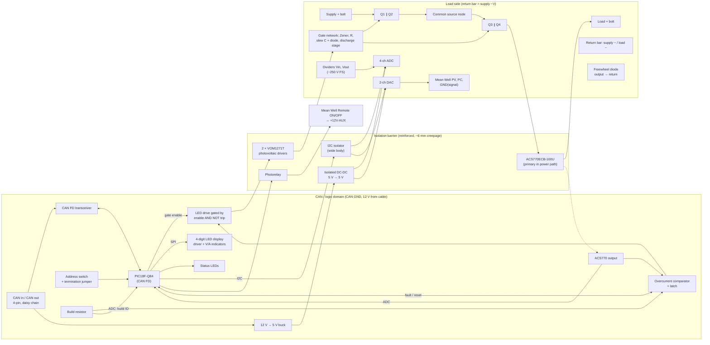

# ThlHats requirements

Status: draft, 2026-10-04. Items marked **TBD** need a decision before
schematic work starts on that board. Part numbers come from the user's earlier
design and are guidelines: better parts may replace them.

## 1. Purpose

ThlHats is a small family of boards for HASS (highly accelerated stress
screening) test racks. A HASS rack needs CAN, serial and a modest amount of
general I/O. Today that means USB dongles, extra wall warts, USB cables, and
DAQ hardware that is either cumbersome (LabJack T7) or expensive and
over-provisioned (NI cards: a whole card for two analog channels).

The goal is to replace that clutter with a Raspberry-Pi-hosted stack that
needs **one host connection and as few supplies as possible**, and is quick
and safe to wire under a hectic test schedule.

### Goals

- CAN, RS-232, RS-485 and "a handful" of DI, DO, relay drive, AI and AO,
  all reachable from the user's Python test framework.
- Small boards: each board carries few enough connectors to fit on its edges
  (see 4.1). An earlier all-in-one board grew too large for this reason.
- Robust against wiring mistakes, which are common during testing.
- Low cost: 2-layer boards, at most 100 × 100 mm, built by PCBWay.

### Non-goals

- Precision or high-speed measurement. The Digilent/MCC DAQ HATs
  (MCC 118, 128, 134, 152, 172) cover those cases and share the same stack.
- Duplicating functions already available as off-the-shelf HATs.
- Powering the host. The Pi 5 and Orange Pi 6 keep their native USB-C supplies.

## 2. System context

- **Hosts:** Raspberry Pi 5 and Orange Pi 6 (Plus). The user manages
  device-tree overlays in the Python project.
- **Shared header:** boards on the 40-pin header coexist with up to 8 MCC DAQ
  HATs. The reserved and free pins are listed in `CLAUDE.md`, under
  "Raspberry Pi header sharing". In summary:
  - Never use SPI0, BCM 12/13/16/20/21/26, or ID_SD/ID_SC.
  - Never fit a HAT ID EEPROM.
  - I2C1 is shared; keep devices off addresses 0x20–0x27. This rules out
    MCP23017-class expanders on I2C1, since their address pins only select
    within 0x20–0x27.
- **Mounting:** M2.5 Raspberry Pi standoffs (58 × 49 mm hole pattern).
  Component height is not a hard limit: tall parts such as DB9s are handled
  with longer stacking headers/standoffs or by placing the board at the top
  of the stack.
- **Software:** the Python test framework talks to every board from user
  space, with **no kernel drivers, udev rules or sudo** (IT/security policy on
  classified and ITAR systems; decided 2026-10-06): TCP/UDP sockets to the
  controller, standard tty devices for serial, and a common I/O protocol
  (section 7). Preferred host links, in order: Ethernet, RS-485, RS-232,
  USB/GPIB as a last resort.

## 3. Power architecture

Decided 2026-10-04; can-controller revised 2026-10-06 (Ethernet, no USB, every
CAN bus isolated on its own).

```
Host USB-C supply ──► Pi 5 / Orange Pi 6 ──► header 5 V ──► logic domain of header boards (serial-io)
                            └─► Ethernet ──► rack switch ──► can-controller (isolated by the jack's magnetics)

12 V DIN supply (floating output) ──► can-controller 12 V terminal ──► RACK domain
        │                                                            ├─► relay coils (via PhotoMOS)
        │                                                            ├─► CAN1 cable supply (POWERED jumpers, fused)
        │                                                            └─► isolated DC-DC ──► LOGIC domain (floating)
        │                                                                                   ├─► MCU, W6100, GPIO, AI
        │                                                                                   └─► ISOW1044 x4 ──► CAN1..CAN4 (each floating)
        └── its 0 V is the RACK ground; it reaches a CAN bus only through that bus's POWERED jumper
```

### 3.1 Host and logic domain (header boards)

- Hosts are powered by their native USB-C supplies: Raspberry Pi 5 from its
  5 V / 5 A supply, Orange Pi 6 Plus from 20 V / 100 W USB-C PD.
- Our boards **never drive the header 5 V**. On the Orange Pi 6 the header
  5 V is an output of its own regulator, so back-feeding it would fight that
  regulator.
- Header boards draw their logic power from the **header 5 V** (and make their
  own 3.3 V). Budget: **≤ 1 A for all of our boards together**. The Pi 5 is
  the limit: it leaves about 1 A worst case after itself and its USB ports.
  The Orange Pi 6 Plus header 5 V is rated for about 4 A (reference found by
  the user, 2026-10-04).
- MCC HATs also draw from the header 5 V and count against the same budget.
- can-controller has no header connection and uses none of this budget.

### 3.2 can-controller power (decided 2026-10-06)

- **One external 12 V DIN-rail supply** with a **floating** output (normal for
  DIN-rail supplies) on a keyed power terminal. It powers the whole board.
  Input protection: reverse polarity, TVS, fuse.
- **RACK domain** (DIN supply 0 V): relay coil outputs and the CAN1 cable
  supply. Relay coils are rack wiring, not DUT wiring.
- **LOGIC domain**: an **isolated DC-DC** from 12 V, **TRACO TDN 5-2411WI**
  (checked 2026-10-06: 9-36 V input, 5 V at 1000 mA, 80 % typ., 50 V / 1 s
  surge, 1600 VDC functional isolation, DIP-8; full load to 50 °C, so the
  rack-side ambient is fine; avoid traces under it), makes 5 V for the ISOW1044s
  and a 3.3 V LDO for the MCU and W6100. Budget at 5 V: W6100 98 mA typ. at
  100 Mbit (265 mA max on a 10 Mbit link), MCU, LEDs: about 0.3 A at 3.3 V worst
  case; ISOW1044 about 80 mA each with traffic, 124 mA typ. / 211 mA max each
  with the bus held dominant. Typical about 0.65 A; all four buses held
  dominant at typical current about 0.8 A; only the datasheet maximum on all
  four at once (about 1.15 A) exceeds the converter, which then folds back
  (short-circuit protected) rather than failing.
- **CAN1-CAN4**: each bus side is powered by its own ISOW1044's integrated
  isolated DC-DC. No bus-side buck.

### 3.3 Where the isolation is

**Design rule: no assumptions about the DUT** (user, 2026-10-06). DUT grounds
are probably common, but we neither control nor ask: every DUT-facing
interface floats, so customers never need a grounding discussion.

| Domain | Ground | Contents |
|--------|--------|----------|
| RACK | 12 V DIN supply 0 V | 12 V input, relay outputs (OUTn / 0 V), CAN1 cable supply |
| LOGIC | floating | MCU, W6100, GPIO, AI (GPIO and AI share this ground, as on any DAQ card) |
| CAN1 ... CAN4 | each floating, isolated from each other | bus side of one ISOW1044, TVS, termination, connector |
| Host | — | Ethernet, isolated by the jack's magnetics |

| Crossing | Part |
|----------|------|
| Mains to RACK | The DIN supply itself (SELV, floating output) |
| RACK to LOGIC (power) | Isolated DC-DC module |
| LOGIC to CANn (data and power) | **TI ISOW1044** isolated CAN FD transceiver with integrated isolated DC-DC (5 kVrms, SOIC-20 footprint DFM package); one per bus |
| LOGIC to RACK (relays) | 2 × dual PhotoMOS, LED side in LOGIC, contacts switching +12 V to the coils |
| LOGIC to host | Ethernet magnetics in the RJ45 jack |
| RACK to CAN1 (optional) | **POWERED jumpers**: tie CAN1's bus ground to RACK 0 V and feed +12 V through a PTC to pin 4, for a bus of our own remote nodes (can-ssr). Off: CAN1 floats like the others. CAN2-4 have no cable supply (pin 4 not connected). |

The 12 V-status optocoupler is gone: the board runs from the 12 V supply, so
without it the board is simply off.

Layout rules that follow:

- Split the copper into the six domains; nothing but the crossing parts above
  may bridge a gap. Island-to-island gaps between CAN buses at least 2 mm.
- Keep creepage across LOGIC|CANn per the ISOW1044 datasheet (its DFM package
  gives 8 mm under the body) and fit its ferrite beads per TI's layout guide.
- The relay supply comes from the RACK domain: the PhotoMOS contacts, the
  flyback diodes, the relay LEDs and the relay PTC sit in RACK, and the
  PhotoMOS packages straddle LOGIC|RACK.

### 3.4 Serial board power

- Logic from the header 5 V budget (3.1).
- The RS-485 port has an isolated bus side powered by a TEA1-0505HI
  (5 V to isolated 5 V, 1 W). Check that its light-load output stays under the
  TPT7488's 5.5 V maximum.
- RS-232 (ST3232B) is not isolated.

## 4. Boards

### 4.0 Development plan: core board + daughter cards (decided 2026-10-06)

The full can-controller did not route on 100 x 100 mm, 2 layers, with six
isolation domains. First plan (same day): proof-of-concept boards per
subsystem plus a plug-in PIC + power module (`boards/pic-module`, committed
as a reference, not to be built). Revised plan (user, 2026-10-06):

1. **Core board** (100 x 100 mm, the cheap PCBWay/JLCPCB class): PIC32MK, the
   12 V power entry and isolated logic supply, and **Ethernet** (W6100 +
   JD0-0004NL), i.e. everything every configuration needs. Circuits from the
   can-controller schematic (4.1) and the pic-module (crystal: Abracon
   ABM3-12.000MHZ-B2-T, CL 18 pF, 27 pF C0G load caps; supply island under the
   QFP). The only board with an MCU: the TQFP is hand-soldered once per core.
2. **Daughter cards** (100 x 100 mm each) on a common daughter interface (TBD:
   stacking vs side-by-side, connector, pin budget), in this order:
   - **CAN card**: the 4 isolated CAN FD channels of 4.1 (ISOW1044, CAN1
     POWERED jumpers).
   - **"LabJack light" card**: the small I/O of 4.1 (relay drive, GPIO,
     differential AI) so a user does not buy a whole MCC HAT for two digital
     outputs and another for one analog input.
   - **Serial card**: a couple of RS-232 and a couple of RS-485 ports. May be
     skipped if a serial Pi HAT coexists with the MCC stack (the user saw pin
     contention earlier). Note: a Pi serial HAT needs a device-tree overlay and
     kernel driver (e.g. sc16is7xx), against the no-driver/no-sudo preference
     (2); a serial card behind the core's Ethernet needs neither.
3. If the cards work, the **final product may stay modular** (core + cards,
   all 100 x 100 mm, can-ssr's stack outline) instead of one board of at most
   115 x 170 mm (user's tool limit; above 100 x 100 mm both fabs price by
   area: PCBWay lists 100 x 100 mm at $5 and 150 x 100 mm at $41). Decide
   after the POC cards.

The can-controller schematic (section 4.1, hardware/gen_schematic.py) stays the
reference design the core and cards are cut from.

### 4.1 Primary controller: `can-controller` (Ethernet, no Pi header)

| Item | Requirement |
|------|-------------|
| MCU | **PIC32MK1024MCM064-I/PT** (4× CAN FD, 12-bit ADC, 3× DAC, 4 op amps, 4× I2C, 1 MB flash, 256 KB RAM, TQFP-64). **Corrected 2026-10-05:** the PIC32MK1024GPK064 chosen on 2026-10-04 has *no* CAN FD (DS60001519E Table 1: CAN FD column "—" for all GPK parts); only the motor-control MCM parts have the 4 CAN FD modules. Same 64-pin pinout. 12 MHz crystal. Its USB is unused since 2026-10-06. |
| Host link | **Ethernet** (decided 2026-10-06; replaces USB): **WIZnet W6100** (IPv4/IPv6 dual stack, hardware TCP/IP, 8 sockets, SPI to the PIC32, LQFP-48 0.5 mm) + 25 MHz crystal + **RJ45 jack with integrated magnetics and LEDs: JD0-0004NL** (user's choice, 2026-10-06) + ferrite bead **HI1206P121R-10** (1206) between the chip's analog and digital 3.3 V supplies (user's earlier design). Reason: plain TCP/UDP sockets need no kernel drivers, udev rules or sudo, which IT/security policy (classified and ITAR systems) often forbids. A switch is always assumed in the rack; bench users need one too. The W6100 is *not* pin-compatible with the W5500 (it matches the W5100S), so the choice is made at layout. **No USB and no Pi header connector** (2026-10-06). Firmware updates over the ICSP header; a network bootloader may come later. |
| CAN | **4 channels** (decided 2026-10-05), **CAN FD**, **each isolated on its own** (**TI ISOW1044**, decided 2026-10-06; replaces the ISO1044BD, whose bus sides shared one 12 V-domain ground and buck). One bus is reserved for our remote nodes (can-ssr, which always needs this controller: decided 2026-10-06); the other three are for DUTs, so one HASS run can test several DUTs. Each is a 4-wire bus: CANH, CANL, GND, +12 V on a **3.5 mm 4-pole pluggable terminal** (Phoenix Contact MC 1,5/4-G-3,5, 1844236; plug 1840382), pin 1 CANH, 2 CANL, 3 GND, 4 +12 V, same on every board (decided 2026-10-04). Pin 3 is the bus's own isolated ground. **CAN1** (next to the RACK domain) has the **POWERED jumpers** (section 3.3) that tie its ground to RACK 0 V and feed fused +12 V to pin 4 (PTC **≥ 2 A hold**: up to 4 can-ssr at about 0.2 A each, estimated, plus derating in a warm stack); on CAN2-4 pin 4 is not connected. Switchable 120 Ω termination. |
| Power | Everything from one external 12 V DIN supply; LOGIC through an isolated DC-DC (section 3.2) |
| GPIO | **4** (reduced from 8 on 2026-10-06), each software-configurable as input or output, **3.3 V** logic, **on PIC32 pins directly**. **Not 24 V tolerant** (decided 2026-10-06): series resistor + ESD clamp only, to survive ESD and a brief 5 V short. Each GPIO has its own ground terminal. |
| Relay drive | **4 outputs** (reduced from 8 on 2026-10-06) for **standard 12 V coil relays**. Each output is a **PhotoMOS** channel: **2 × Panasonic AQW212** (2 Form A, DIP-8 through-hole; checked 2026-10-06: 60 V, 500 mA per channel, 2.5 Ω max on-resistance, so a 12 V coil drawing 20-100 mA loses at most 0.25 V; LED operate current about 0.9 mA, drive about 5 mA; 1500 Vrms I/O isolation, functional only. No current limiting: the shared PTC protects the outputs) that **sources +12 V** from the 12 V domain to the coil; the coil's other end returns to 12 V-domain 0 V on the same terminal pair. The PhotoMOS is the isolation barrier: its LED is driven from a PIC32 pin through a resistor (about 4 mA), so there are **no digital isolators, no ULN2803A and no GPIO expander** (decided 2026-10-06; supersedes the 2026-10-05 ISO6740 + ULN2803A + MCP23008 design). Per output: a flyback diode from OUTn to 0 V and an indicator LED. The shared relay feed is fused (PTC). Coils from the 12 V domain only. |
| Analog out | **Dropped** (2026-10-06). MCC 152 covers 0–5 V; can-ssr covers Mean Well PV/PC programming. |
| Analog in | **2 differential channels** (decided 2026-10-06: no assumption about the DUT ground), about ±116 V full scale per input, 10 MΩ per input, on the **PIC32's internal 12-bit ADC**. Each of AIn+ and AIn− has its own 10 MΩ / 130 kΩ divider to **VMID ≈ 1.65 V** (PIC32MK OA5 as a follower; VMID also on AN25), 0.1 µF across each 130 kΩ (fc ≈ 12 Hz) and a BAT54S clamp; firmware reads both legs and subtracts, so VMID and the common mode cancel. Each leg must stay within about ±116 V of the LOGIC ground (which floats unless GPIO ties it to a DUT). Common-mode rejection is set by divider matching: with 1 % resistors a 50 V common mode can show up to about 0.5 V of error, so calibrate in firmware or use 0.1 % parts where it matters. About 57 mV per count. Uses 4 ADC pins + AN25. Terminal: lower level AIn+, upper level AIn−. Kept because MCC 118/128 stop at ±10 V. |
| Mounting | **Stack interface** (section 4.4, decided 2026-10-06): 4 × M4 corner holes on a 91 × 91 mm square. **No Pi holes** (dropped 2026-10-06: the board has no header connection, and stacking with can-ssr matters more). Checker exemption in boards/can-controller/board.json. |
| Stack position | **Base of a can-ssr stack** (section 4.4): on the DIN base plate, up to 4 can-ssr boards above it. CAN1 sits at the stack CAN position so a short jumper reaches the first SSR's CAN IN. |
| Size | Final board **at most 115 × 170 mm** (decided 2026-10-06, after 100 × 100 mm proved unroutable; see 4.0). The 100 × 100 mm stack interface (4.4) will need revisiting for the larger final board. |

Scope (decided 2026-10-06). The board fills the gaps the MCC HATs leave:
**4 × isolated CAN FD** (the main benefit) and **relay drive**, plus "a couple"
of GPIO and high-voltage AI so one card covers small jobs (the LabJack T7 idea,
with less). Anyone who needs more channels, more precision, or analog out
adds an MCC HAT. The rev 3 design had grown too complex (8 relays through
isolators and an I2C expander, a DAC with a reference, op amp and boost);
analog out, the expander and 24 V-tolerant GPIO were cut.

**io-card update (2026-10-09):** the double-level SPTD terminals (24.2 mm tall)
do not fit under the next card in the stack (about 11 mm, ESQ-120-14), so the
io-card uses pluggable single-level **MC 1,5 G-3,5** headers (7.7 mm, FMC
push-in plugs), each signal next to its return: J30 relays 10 positions, J40
I/O 12. The relay outputs drive **external** relay coils; JP1 selects the coil
supply: rack +12 V or an external supply up to 24 V on J30 (F30 rated 33 V).

Terminal count: 4 × CAN on MC 3,5 4-pole (16 positions); field I/O on
double-level push-in terminals, one level signal and one level return:
relay 4 (OUTn / 0 V), GPIO 4 (IOn / GND), AI 2 (AIn+ / AIn−), so 10 positions.
About 26 positions plus the RJ45 and the 12 V input, against about 45 before.
All resistors are discrete 1206 (too few repeated channels for resistor
networks to pay off).

### 4.2 Remote CAN node, SSR: `can-ssr` (off the header)

| Item | Requirement |
|------|-------------|
| MCU | **PIC18F47Q84-I/PT** (TQFP-44, 10 × 10 mm, 0.8 mm pitch): the largest-memory Q84 (128 KB flash, ~12.5 KB RAM, 1 KB EEPROM), the common part for all PIC18 CAN nodes. Changed 2026-10-04 from the PDIP-40 (I/P) to free board space; the user accepted TQFP for this. |
| Power | From the 4-wire CAN cable: 12 V, referenced to CAN bus ground. The node's logic lives on the CAN bus side. |
| Goals | Cover the 80% case for test engineers: more voltage and more current are better. Stretch: up to **200 V** or up to **50 A**, not necessarily at the same time. Designed specifically around **Mean Well adjustable supplies** (PV/PC/remote on-off); the specific supply is the test engineer's choice. Measurement precision is not critical: HASS mainly needs to detect catastrophic DUT failures (user, 2026-10-04). |
| Purpose | Turns a "dumb" fixed bench or DIN supply into a simple automatable DUT supply, replacing expensive, bulky SCPI rack supplies (e.g. BK Precision) where a single fixed voltage is enough (user, 2026-10-04). |
| Function | High-side switch with **reverse current blocking**, DC loads up to **120 V DC, 30 A**. Load side isolated from the CAN/logic side. Switch: **two N-channel MOSFETs back to back (common source)**, gate driven by Vishay **VOM1271T** photovoltaic driver(s) across gate–source (floating, so high-side N-channel needs no charge pump; also isolates the gate drive). Gate–source Zener + resistor; discharge stage for fast turn-off. Chosen over P-channel for Rds(on), decided 2026-10-04. **30 A continuous** rating with **two MOSFETs in parallel per side (four total)** for thermal margin; DUTs needing more go to a full rack supply (target is the 80% case). MOSFET part **TBD**, lead candidate Infineon IPB068N20NM6 (D2PAK, 6.8 mΩ, tabs soldered to the busbar), pending a turn-on SOA check. Capacitive load limit: **1 mF at 120 V** (DUTs are electronics, not motor drives); turn-on SOA is checked assuming one MOSFET per side carries the whole inrush. |
| Measurement | Load current by **Hall-effect sensor: Allegro ACS770ECB-100U-PFF-T** (100 A unidirectional, ~40 mV/A, 5 V ratiometric, isolated output; see Build options). Its output also feeds the fast hardware overcurrent trip comparator. **Input (supply) and output (load) voltage**, each by resistor divider + anti-aliasing filter, referenced to the return bar (decided 2026-10-04). Voltages sampled continuously at 240 SPS per channel (two MCP3426), current by the PIC ADC at kHz rates; **reporting rate configurable, 10 Hz default, up to 100 Hz** (decided 2026-10-04: storage is trivial, ~15 MB per 2 h run for two supplies at 100 Hz in InfluxDB). Current reported as average and peak per period. Planned firmware feature: fault capture, a rolling ~1 s buffer sent around a trip or anomaly. Firmware uses input voltage to refuse or warn on switch-on with the supply absent, and input − output to report the drop across the board. |
| Protection | No automotive blade fuse: those are rated 32–58 V DC and can sustain an arc at 120 V. Backup fuse rated ≥ 125 V DC (e.g. a 10 × 38 mm midget fuse) or none: **TBD**. Fast hardware overcurrent trip that turns the switch off without the firmware. Outputs off automatically when the controller stops talking (CAN heartbeat timeout), at reset and at power-up. |
| Build options | **One PCB layout, three builds** (decided 2026-10-04), laid out for the worst case of both (≥ 250 V working clearances, 50 A copper/busbars). MOSFETs are 4 × Infineon D2PAK (TO-263-3), two in parallel per side; build-specific parts are only the 4 MOSFETs and **one build resistor** (sets both the hardware trip threshold and the build ID; see 4.2.1). Current sensor **ACS770ECB-100U** on all builds. A mid build (150 V, IPB048N15N5LF) can be added later as a BOM/firmware change. See section 4.2.1. |
| Load-side isolation | One isolated load-side domain referenced to the return bar: isolated DC-DC, reinforced I2C isolator, 4-channel ADC (Vin, Vout dividers), 2-channel DAC (Mean Well PV, PC). Chosen over AMC1100/AMC1311 isolated amplifiers, decided 2026-10-04. |
| Supply programming | **Option A, decided 2026-10-04**: the power path stays an on/off switch; variable voltage comes from the supply's own remote programming input. The board provides isolated analog outputs referenced to the return bar (supply −V): **PV** (voltage) and **PC** (current limit), plus an isolated dry contact for the supply's **Remote ON/OFF**. Firmware closes the loop on the measured input voltage. With a fixed supply these are left unconnected. Typical use: DUT nominal 100 V, tested at 60 / 90 / 100 / 110 V. Example supply (not a design target): Mean Well **UHP-1500-115** (115 V, 13.05 A, 1500 W; PV sets 50–120 % = 57.5–138 V from about 1–4.8 V on CN71 pin 1; PC sets 20–100 % current; PV/PC are **non-isolated, referenced to −V**; Remote ON/OFF is a dry contact to its isolated +12V-AUX). |
| Display | **4-digit 7-segment LED, 0.56 in** (Kingbright CC56-12SRWA) readout of voltage and current (no OLED: burn-in on long runs). Kept at 0.56 in once the Pi holes were dropped (2026-10-04). |
| Channels | **One** per board. Decided 2026-10-04. |
| Mounting | **Stack interface** (section 4.4, decided 2026-10-06; replaces the 2026-10-04 M3 pattern): 100 × 100 mm, 4 × M4 corner holes on a 91 × 91 mm square, **insulating standoffs** (the lower holes sit in the load area), 4 mm copper keep-out around the load-side holes. Stacks up to 4 high on a can-controller, or lies side by side in a 1U/2U rack shelf. **Layout changes for the stack** (can-ssr not yet ordered; all done 2026-10-06): M4 standoff holes; load bolts moved inward (S+ 18, S− 36, L− 63, L+ 82 mm) with their bars, return bar and pours; MAX7219 corner reworked. CAN IN and CAN OUT become one **double-level header** at the stack CAN position (Phoenix MCDN 1,5/4-G1-3,5 P26 THR, item 1953732: CAN IN on the lower level, CAN OUT on the upper; same MC 3.5 plugs; decided 2026-10-06) (footprint drawn from the Phoenix dimensions; vendor STEP kept local). No DIN clips on the board: the base plate carries them. Checker exemption in boards/can-ssr/board.json. |
| Safety | 120 V DC is above the 60 V DC SELV limit: creepage/clearance between the load section and logic, a Vgs clamp, switch devices rated about 200 V. |
| Current path | Top-side PCB traces with the solder mask removed, with a copper busbar soldered on: **½" × ⅛" (12.7 × 3.2 mm) C110 flat bar, the same on all builds** (~40 mm², ~3× margin at 50 A; doubles as the MOSFET heatsink; stock at McMaster/OnlineMetals; metric 12 × 3 mm). Solder with the board on a hot plate (~150 °C preheat) and a 100 W+ iron. M5 bolts (5.3 mm holes) through bar, board and ring lug. MOSFET tabs on their own pads beside the bar; the bar stops short of the ACS770 leads (decided 2026-10-04). Load wires connect by bolt and nut through holes in the busbar/trace (ring lugs), not PCB terminal blocks. Four bolts: supply +, load + (switched path through fuse/MOSFETs/Hall sensor) and supply −, load − (return: a short straight copper bar with two holes, unswitched). The voltage sense references the return bar. **The return bar is on the bottom side, clamped by the S− and L− bolts, not soldered**; the top side carries only the switched path, and there is no other-net copper on the bottom under it. Bolt order along the bottom edge: S+, S−, L−, L+; all lugs on top. S−/L− current reaches the bottom bar through the bolt clamp, the plated hole and a ring of ~12–16 × 0.8 mm vias. GND_LOAD (measurement ground) is a single trace from the S− pad; the bar drops ~1 mV at 50 A. (Decided 2026-10-04: 39 mm under the barrier cannot fit both bars on top.) Bars as laid out: VIN ½" at S+ (H1), VOUT_SW ½" beside Q3/Q4, source node ¼" × ⅛" between the MOSFET columns, VOUT ½" from the ACS770 down through L+ (H3), return ½" on the bottom between S− and L−. **Production boards use 2 oz outer copper** (decided 2026-10-05: cheaper than the labour of more busbar; it halves the drop in the copper between the VIN bar and Q1's tab). Assembly order and hot-plate steps: boards/can-ssr/README.md. High-voltage clearance 1.5 mm (IPC-2221B B2 151–300 V: 1.25 mm) via net classes HV/GD and can-ssr.kicad_dru; the CAN/logic–load barrier is a 6 mm keep-out at y 42–48 mm. |
| Connectors | CAN in and CAN out (daisy chain), two Phoenix MC 3.5 mm 4-pole headers, pinout as in 4.1; **CAN IN and CAN OUT on one double-level header at the stack CAN position** (section 4.4); load connections are bolted (see Current path) |
| Addressing | **16-position hex rotary switch** (Nidec Copal SH-7000 series, through-hole) for the CAN node address; 2-pin jumper for 120 Ω termination (decided 2026-10-04). |

#### 4.2.1 can-ssr builds and switching strategy

| Build | MOSFET (×4) | Rds(on) max | Max supply | Continuous current (≤ ~10 W total, still air) | Hot switching |
|-------|-------------|-------------|------------|-----------------------------------------------|---------------|
| **HC** (high current) | IPB021N10NM5LF2 (100 V, Linear FET 2) | 2.1 mΩ | 60 V (48 V Mean Well at 120 %) | **50 A** (~5 W cold, ~9 W hot) | Allowed, within limits below |
| **STD** (standard) | IPB110N20N3LF (200 V, Linear FET) | 11 mΩ | 150 V | **25 A** (~7 W cold, ~12 W hot); decided 2026-10-04 over a 30 A non-Linear-FET option to keep hot switching | Allowed, within limits below |
| **HV** (high voltage) | IPB407N30N (300 V, standard trench) | 40.7 mΩ | 200 V | **12 A** (~6 W cold, ~10 W hot) | **Not allowed**: sequenced only |

Hot Rds(on) taken as 1.7 × the 25 °C maximum. Two in parallel per side and two
sides in series make the total path resistance about one device's Rds(on).

**Switching strategy.** The VOM1271T turns the MOSFETs on slowly (about 15 µA of
gate current), so a "hot" turn-on into a live supply holds them in their linear
region. The IPB407N30N's SOA collapses in that region at 100 V and above
(Spirito effect: its 10 ms SOA is well under 1 A there), and even the Linear
FETs can only carry about 1 A for that long at 100–150 V. So:

1. **Sequenced turn-on (default, all builds).** With the Mean Well supply's
   Remote ON/OFF wired to the board: supply off → close the switch (no voltage,
   no stress) → set PV/PC → supply on. The supply's own soft start and constant
   current limit handle the DUT inrush. Turn-off: open the switch, then supply
   off. Turn-off is fast (µs, through the discharge stage), well inside SOA.
2. **Hot turn-on (fallback, HC and STD only)**, e.g. a fixed supply with no
   remote input. A gate–drain capacitor (in series with a diode, so it does not
   slow turn-off) limits the output slew to about 0.5 V/ms: 1 mF of DUT
   capacitance then draws about 0.5 A, and 120 V takes about 240 ms. Limit: DUT
   capacitance ≤ 1 mF and DUT load during the ramp ≤ ~0.5 A (a DUT whose
   converter starts part-way up the ramp is the main risk). The slew network is
   fitted on every build; on HV, firmware refuses to close the switch if the
   input voltage is above about 20 V.

HASS timing: supply changes on a ~100 ms timescale are fine (user,
2026-10-04), so switching speed is never a design driver; turn-off is
deliberately controlled (a few µs) rather than as fast as possible.

**Build identification (decided 2026-10-04).** One firmware image for all
builds. The build is a *physical* difference only, never stored in flash
(flash holds calibration data only). A single **build resistor** forms the
reference divider of the hardware overcurrent comparator, so the same part
sets the trip threshold (about HC 60 A, STD 35 A, HV 15 A) and, read by a PIC
ADC pin, tells firmware which build it is on. The two cannot disagree.
Resistor values are widely spaced; a reading outside the three bands (missing,
open, shorted, wrong value) is a fault: the switch stays off and the fault is
reported over CAN. Open resistor = zero trip threshold, so the hardware itself
cannot turn on. The silkscreen carries a build checkbox (HC / STD / HV).

**Common to all builds (single layout):**

- Current path: supply+ bolt → input bar (Q1/Q2 drain tabs) → common-source node
  (gate driver reference) → Q3/Q4 → output bar (drain tabs) → ACS770 → load+ bolt.
  Return: two-hole bar. Busbars solder onto mask-free top copper.
- Per-MOSFET gate resistors; gate–source Zener (15 V) and resistor; discharge
  stage for fast turn-off; two VOM1271T in series for about 16 V of gate drive.
- Freewheel diode from output to return (inductive DUT wiring), rated for the
  HV build. No build-specific TVS: with controlled turn-off (a few µs) the
  cable-inductance overshoot is a few volts, and all three MOSFETs are
  avalanche rated as a backstop.
- Voltage dividers sized for about 250 V full scale on every build (precision
  is not critical; one BOM).
- Hardware overcurrent trip: comparator on the ACS770 output, threshold set by
  the build resistor (above). Firmware enforces each build's voltage, current
  and hot-switch limits from the same reading.
- Clearances designed for 250 V working: about 6 mm creepage (with a routed slot
  where needed) between the load-side domain and the CAN/logic side; wide-body
  isolators.

#### 4.2.2 can-ssr block diagram

Three domains. **CAN/logic** is referenced to CAN bus ground and powered from
the 12 V in the CAN cable. **Load side** is referenced to the return bar
(supply −V) and powered across a reinforced barrier. **Supply aux** is the Mean
Well's own isolated 12 V aux, reached only through a photorelay contact.



**The PIC stays on the CAN/logic side (decided 2026-10-04).** Moving it to the
load side would let it use its internal ADC and PWM for Vin/Vout and PV/PC, but
the user considers the load/supply side unreliable (supply off, return
disconnected or miswired, DUT faults and 50 A transients on the return). The
controller lives in the quiet, cable-powered domain so it stays responsive and
can always report faults; the load side is only sensors and outputs behind the
barrier.

Key behaviours:

- **Hardware trip is independent of firmware.** The comparator latches and
  removes the VOM1271T LED current directly; firmware can only reset the latch
  after reading the fault, not override it.
- **Watchdog/heartbeat:** if the controller's CAN heartbeat stops, firmware
  opens the switch and turns the supply off through the photorelay. The PIC's
  hardware watchdog resets the MCU, and reset leaves the gate enable low.
- **Power-up and reset:** gate enable defaults low (pull-down), photorelay off,
  DAC outputs at their power-on value (zero).
- **Display:** alternates V and A, with a lit V or A indicator; shows a fault
  code on a trip or a build-resistor fault.

Part candidates (to confirm at schematic time; hand-solderable packages):
CAN FD transceiver (5 V), 2 × MCP3426 ADC (SOIC-8, one per voltage, for 100 Hz),
2 × MCP4725 DAC (SOT-23-6, different A0), TI UCC12050
isolated DC-DC (reinforced, wide SOIC-16) or a module, ISO1640 (wide SOIC-16)
I2C isolator, MAX7219 display driver (wide SOIC-24), a photorelay with ≥ 60 V
contacts for the Mean Well remote input.

This board is the first of a possible family of bus-powered CAN nodes
(relay, analog, digital), each with a single function and few connectors.
Whether to build more nodes is a later decision.

### 4.3 Serial expander: `serial-io` (on the header)

| Item | Requirement |
|------|-------------|
| UARTs | One SC16IS752 dual UART on shared I2C1 (one address in 0x48 and up, one IRQ line). Linux `sc16is7xx` driver gives `/dev/ttySC0` and `/dev/ttySC1`. |
| RS-232 | **1 port** (reduced from 2 on 2026-10-04; covers the common case), TX/RX only, ST3232BDR (one channel spare). Not isolated. |
| RS-485 | **1 port** (reduced from 2 on 2026-10-04: CAN now reaches the SSR nodes, so one port covers the common case). **Full duplex, isolated**: TPT7488-SOBR (isolated full-duplex transceiver, 5 kV RMS) with a TEA1-0505HI for the isolated bus side. Point-to-point (no driver enable). Switchable termination. |
| Header pins | I2C1 (pins 3/5) plus 1–2 IRQ GPIOs from the free list. Exact pins: **TBD**, after checking on the Orange Pi 6. |
| Throughput | Console and Modbus rates; two ports at 115200 fit comfortably on 400 kHz I2C. |
| Connectors | **DB9** for both ports, one on each short side edge. Use male for RS-232 and female for RS-485 so the two can't be swapped. DB9 height means this board goes at the top of the stack or uses taller stacking hardware. |
| Size | Standard HAT, 65 × 56.5 mm |

### 4.4 Stack interface: can-controller + can-ssr (decided 2026-10-06)

can-ssr always works with a can-controller, so the two stack. Two installations:

- **Compact DIN enclosure:** the controller on a base plate (3D printed,
  carries the DIN clips), **up to 4 can-ssr above it**. Boards stand
  **vertical** (the stack sticks out from the back panel) so the gaps between
  boards work as convection chimneys; add a fan when DUTs draw high current.
- **Tower rack:** boards lie side by side in a 1U or 2U shelf; no stacking.

| Item | Requirement |
|------|-------------|
| Outline | 100 × 100 mm, 3 mm corner radius, both boards |
| Holes | **4 × M4 (4.3 mm)** at (4.5, 4.5), (95.5, 4.5), (4.5, 95.5), (95.5, 95.5) mm from the top-left corner (**91 × 91 mm square**; 4.5 mm rather than 5 mm so can-ssr's MAX7219 keeps its place). Footprint `Thl_Mechanical:MountingHole_4.3mm_M4_Standoff7mm`: courtyard 4.3 mm radius on both sides (7 mm A/F hex standoff, circumradius 4.04 mm), so no parts within 4.3 mm of a hole centre, top or bottom. Copper may run under the (insulating) standoffs except in can-ssr's load area, where no copper comes within 4 mm of the hole edge |
| Standoffs | **Insulating** (glass-filled nylon) M4 male-female hex, about 35–40 mm (set by can-ssr's lug height plus cable bend; **TBD**), forming continuous columns from the base plate. Each board is only clamped between spacers, so cable forces go into the plate. Insulating because the can-ssr lower holes sit in its load area (up to 200 V on the HV build): a metal column would tie four load areas together and be touchable. |
| Assembly | **Wire as you stack**, bottom up: the board above blocks tool access to can-ssr's load bolts. Service means unstacking. |
| CAN position | Left edge (component side up, holes at the top), horizontal header with its mating face at the edge, **pin 1 (CANH) at y = 15.5 mm** from the top edge, then CANL, GND, +12 V at 3.5 mm pitch downward (decided 2026-10-06). can-controller CAN1 is an MC 1,5/4-G-3,5 there (courtyard about y 12.45–29.05); each can-ssr has a **Phoenix MCDN 1,5/4-G1-3,5 P26 THR** double-level header (CAN IN and CAN OUT, wired in parallel) with the same pin positions, so short jumpers (MC plug at both ends) run straight between levels. |
| Stack depth | Controller plus 4 can-ssr at 35–40 mm pitch: about 180–200 mm |

### 4.5 Daughter-card stack bus (decided 2026-10-06)

Boards: **`core`** (PIC32MK, 12 V entry + isolated logic supply, Ethernet),
**`can-card`**, **`io-card`** ("LabJack light"), **`serial-card`**. All
100 x 100 mm with the 4.4 stack holes (4 x M4, 91 x 91 mm), stacked on the
core. Definition in code: `tools/stack_bus.py` (pinout and the core's MCU pin
map); board generators import it.

| Item | Decision |
|------|----------|
| Stack order | **Core on top** (decided 2026-10-06): RJ45, 12 V input, ICSP and LEDs stay reachable, nothing above the core's tall parts (RJ45 about 13.5 mm). The core has 2 x 20 / 2 x 3 **pin headers on its underside**; each card has ESQ stacking sockets on top with tails through to the card below. Card parts must stay below the stacking height. |
| Floorplan (all boards) | Bus J10 along the left edge, rack power J11 at the right edge inside a RACK strip about 25 mm wide (relay outputs, CAN1 bus power on cards; 12 V entry and U20 on the core). Exact pin positions in `tools/stack_bus.py`. Core: RJ45 on the bottom edge, right-angle ICSP and debug UART on the top edge, 12 V input J20 horizontal-entry at the right edge. |
| Logic bus | 2 x 20, 2.54 mm, Samtec **ESQ-120** stacking sockets (long tails through each card; plain 2 x 20 headers for prototypes). 33 signals + 7 supply pins (+5V x2, +3V3, GND x4). LOGIC domain only. |
| Rack power | Separate 2 x 3, 2.54 mm **ESQ-103** at the opposite edge: +12V x3 (after the core's input protection) and GND_RACK x3. Distance between the two connectors is the RACK/LOGIC isolation; each card keeps its rack-side parts (relay outputs, CAN1 bus power) near it. |
| Card blocks | can-card: C1-C4 TX/RX (8). io-card: RLY1-4, GPIO1-4, AI1+/-, AI2+/- on the PIC's ADC, VMID (13). serial-card: U2-U5 TX/RX + DE1/DE2 (10). Shared: I2C1 (SCL/SDA, pull-ups on the core). One card of each type per stack, any height. |
| Status LEDs | CAN activity LEDs on the can-card, driven from the TX/RX lines (no MCU pins). |
| Core keeps | SPI3 + CS/INT/RST to the W6100, **debug UART1** (header on the core), heartbeat LED, ICSP, VMID reference (OA5 follower). One MCU pin spare (RB13). |
| RS-485 (serial-card) | Half duplex is the default (full duplex is uncommon); full duplex only if nearly free, e.g. a full-duplex transceiver with driver enable and A-Y / B-Z jumpers. Ports on **DB9**. **Decided 2026-10-09:** half duplex only, no jumpers (ISOW1432 with Y-A / Z-B tied on the PCB). RS-485 isolated (ISOW1432 integrated DC-DC), RS-232 not isolated (ST3232B). DB9s do not fit in the stack (~12.5 mm against ~11 mm), so the ports use right-angle shrouded 2x5 box headers in IDC10-to-DB9 order: a standard ribbon DB9 cable or a small adapter PCB gives the DB9. |

## 5. Requirements common to all boards

### 5.1 Connector budget

Connectors sit on board edges, and edge length is the binding size constraint.
Budget each board's connectors before starting the schematic:

- **Connectors go on three edges only: the bottom and the two sides. The edge
  nearest the Pi header stays clear** (decided 2026-10-04). Boards without a
  header connection (can-controller, from 2026-10-06) may use all four edges.
- The standoffs take the corners, so usable length is about the edge length
  minus 13 mm.
- HAT (65 × 56.5 mm): about 52 mm (bottom) + 43 + 43 mm (sides) ≈ 138 mm.
- 100 × 100 mm: about 87 mm × 3 ≈ 260 mm.
- A 3.5 mm pluggable terminal position takes 3.5 mm; a 5.08 mm one takes 5.08 mm.
- A DB9 takes about 31 mm of edge.
- Give each GPIO and analog channel its own ground terminal, so test engineers
  don't need a separate ground bus.

Double-row terminals (decided 2026-10-05): field I/O uses double-row 3.5 mm
terminals (e.g. Phoenix SPTD 1,5/..-H-3,5 push-in) with **one row always
ground** and the other the signal, so every channel brings its own return and
the test engineer never builds a separate ground harness. The relay outputs
(PhotoMOS, high-side, decided 2026-10-06) pair each OUTn with **12 V-domain
0 V** (coil return), so both coil wires land on the board. CAN keeps the 4-pin MC 3.5 pinout shared
with every board.

Indicator LEDs (decided 2026-10-05, can-controller): one LED per relay, on the
12 V side directly behind its terminal pair (LED + resistor from OUTn to 0 V,
lit when the output is on). CAN activity LEDs on the logic side at the edge of
the CAN strip, lined up with each CAN connector (the area right behind the
connectors is the isolated side). No GPIO LEDs.

### 5.2 Field wiring protection (all external connections)

Wiring mistakes are common under test-schedule pressure, so every
field-facing pin must survive the likely mistakes:

- **Field I/O on push-in terminals soldered to the board** (decided 2026-10-05):
  wires from the board go individually to the rack panel; the standardized
  pluggable interface is between the rack panel and the DUT. **Exceptions,
  pluggable:** CAN (Phoenix MC 3.5, same 4-pin pinout on every board) and
  DB9-type connectors. Superseded rule (2026-10-04): keyed, pluggable
  connectors on every external connection.
- **ESD/TVS protection** on every external pin.
- **Series resistance or PTC** on signal I/O. Inputs must survive a short to
  the highest voltage present on the rack: **24 V** (confirmed 2026-10-05).
  Exception: can-controller GPIO is plain 3.3 V logic (2026-10-06).
- **Reverse-polarity and overvoltage protection** on every supply input.
- **Current limiting or fusing** on every supply output, including the CAN
  bus supply and any sensor supply.
- **Outputs default to off** at power-up, at reset, and when the host link is
  lost (firmware watchdog with a defined failsafe state).

### 5.3 Usability

- A status LED per channel where practical, plus power and heartbeat/host-link LEDs.
- Clear silkscreen: the signal name at every terminal, the board name and revision, and the address/termination setting.
- Configuration (termination, address) by jumper or switch that is visible without disassembly.

### 5.4 I/O signal ranges

| Type | Range / level | Notes |
|------|---------------|-------|
| GPIO | 3.3 V logic, input or output | can-controller: ESD + series R only, not 24 V tolerant (2026-10-06) |
| Relay drive | 12 V coils, sourced +12 V | PhotoMOS high-side; flyback diode per output; PTC on the feed |
| AI | Differential, about ±116 V per input | 10 MΩ per input; low accuracy OK |

### 5.5 Part selection

- Boards are mostly hand assembled; larger parts beat cost and density.
- Chip R/C: 1206 where possible; decoupling capacitors 0805; nothing smaller.
- Ceramic capacitors: X5R/X7R or better (C0G/NP0); never Y5V/Y5U/Z5U.
- Prefer SOIC/SOT/TQFP over leadless packages where there is a choice.

## 6. Mechanical and manufacturing

- 2 layers, at most 100 × 100 mm, rounded corners. Header boards: M2.5 holes on the Pi 58 × 49 mm pattern. can-controller and can-ssr: the stack interface (4.4).
- Header boards: Samtec REF-182665 SMT pass-through socket on top at the HAT
  position, so they stack with MCC HATs using a stacking socket (e.g. Samtec
  SSQ-120-03-T-D).
- PCBWay standard service. House rules are in `tools/house_rules.py`.
- Every part carries `Manufacturer` and `MPN` fields (BOM for ordering, and for PCBWay assembly when used).

## 7. Firmware and host software

- One **host protocol** shared by all boards, defined before the controller
  firmware: discovery and identification (board type, revision, serial
  number), I/O read/write, configuration, and the watchdog. **TBD**.
- Controller over **Ethernet** (decided 2026-10-06): the host uses plain TCP/UDP
  sockets from user space, with no kernel driver, udev rule or sudo. The
  protocol is the user's choice, simpler than SCPI: **TBD**. Discovery (e.g. a
  UDP broadcast reply) and a static-IP default with DHCP: **TBD**. Superseded
  (2026-10-04): USB composite device with gs_usb / SocketCAN and a Microchip
  sublicensed VID:PID.
- **Classic and FD per channel:** each channel is set to classic CAN 2.0 or
  CAN FD (with its own arbitration and data bit rates) from the host. One
  board serves both legacy and FD devices under test.
- **Bus mode rule:** a bus may only carry FD frames if every node on it is
  FD-capable. Run a bus in classic mode whenever a classic-only node (e.g. a
  legacy DUT) is attached. Preferred rack wiring: DUT on one channel, our own
  remote nodes on the other.
- Remote CAN nodes: an application protocol on CAN for I/O and configuration,
  with a heartbeat. **TBD**.
- Each board's firmware lives in `boards/<name>/firmware/`.
