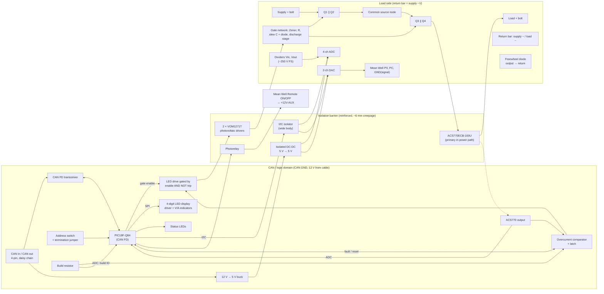

# ThlHats requirements

Status: draft, 2026-10-04. Items marked **TBD** need a decision before
schematic work starts on that board. Part numbers come from the user's earlier
design and are guidelines: better parts may replace them.

## 1. Purpose

ThlHats is a small family of boards for HASS (highly accelerated stress
screening) test racks. A HASS rack needs CAN, serial and a modest amount of
general I/O. Today that means USB dongles, extra wall warts, USB cables, and
DAQ hardware that is either cumbersome (LabJack T7) or expensive and
over-provisioned (NI cards: a whole card for two analog channels).

The goal is to replace that clutter with a Raspberry-Pi-hosted stack that
needs **one host connection and as few supplies as possible**, and is quick
and safe to wire under a hectic test schedule.

### Goals

- CAN, RS-232, RS-485 and "a handful" of DI, DO, relay drive, AI and AO,
  all reachable from the user's Python test framework.
- Small boards: each board carries few enough connectors to fit on its edges
  (see 4.1). An earlier all-in-one board grew too large for this reason.
- Robust against wiring mistakes, which are common during testing.
- Low cost: 2-layer boards, at most 100 × 100 mm, built by PCBWay.

### Non-goals

- Precision or high-speed measurement. The Digilent/MCC DAQ HATs
  (MCC 118, 128, 134, 152, 172) cover those cases and share the same stack.
- Duplicating functions already available as off-the-shelf HATs.
- Powering the host. The Pi 5 and Orange Pi 6 keep their native USB-C supplies.

## 2. System context

- **Hosts:** Raspberry Pi 5 and Orange Pi 6 (Plus). The user manages
  device-tree overlays in the Python project.
- **Shared header:** boards on the 40-pin header coexist with up to 8 MCC DAQ
  HATs. The reserved and free pins are listed in `CLAUDE.md`, under
  "Raspberry Pi header sharing". In summary:
  - Never use SPI0, BCM 12/13/16/20/21/26, or ID_SD/ID_SC.
  - Never fit a HAT ID EEPROM.
  - I2C1 is shared; keep devices off addresses 0x20–0x27. This rules out
    MCP23017-class expanders on I2C1, since their address pins only select
    within 0x20–0x27.
- **Mounting:** M2.5 Raspberry Pi standoffs (58 × 49 mm hole pattern).
  Component height is not a hard limit: tall parts such as DB9s are handled
  with longer stacking headers/standoffs or by placing the board at the top
  of the stack.
- **Software:** the Python test framework talks to every board through
  standard Linux interfaces where possible: SocketCAN (`can0`, `can1`, …),
  tty devices, and a common I/O protocol (section 6).

## 3. Power architecture

Decided 2026-10-04.

```
Host USB-C supply ──► Pi 5 / Orange Pi 6 ──► header 5 V ──► logic domain of our boards
                                                           (MCU, expanders, ADC, AO, isolator logic sides)

12 V DIN supply (floating output) ──► CAN board 12 V terminal ──► 12 V domain
        │                                                       ├─► CAN cable supply (fused per bus)
        │                                                       ├─► buck to 5 V ─► ISO1042 bus sides
        │                                                       └─► relay coils (via isolated drivers)
        └── its 0 V is the CAN bus ground; never connected to logic ground
```

### 3.1 Host and logic domain

- Hosts are powered by their native USB-C supplies: Raspberry Pi 5 from its
  5 V / 5 A supply, Orange Pi 6 Plus from 20 V / 100 W USB-C PD.
- Our boards **never drive the header 5 V**. On the Orange Pi 6 the header
  5 V is an output of its own regulator, so back-feeding it would fight that
  regulator.
- Our boards draw their logic power from the **header 5 V** (and make their
  own 3.3 V). Budget: **≤ 1 A for all of our boards together**. The Pi 5 is
  the limit: it leaves about 1 A worst case after itself and its USB ports.
  The Orange Pi 6 Plus header 5 V is rated for about 4 A (reference found by
  the user, 2026-10-04).
- MCC HATs also draw from the header 5 V and count against the same budget.

### 3.2 12 V domain (CAN board)

- **One external 12 V DIN-rail supply** wired to a keyed power terminal on the
  CAN board. It powers everything heavy: CAN cable supplies for remote nodes,
  the CAN transceivers' bus sides, and the relay coils.
- The supply's output must be **floating** (normal for DIN-rail supplies). Its
  0 V becomes the CAN bus ground. This is what keeps the 12 V domain isolated
  from the Pi: see 3.3.
- Input protection: reverse polarity, TVS, and an eFuse or fuse.
- Each CAN bus gets the 12 V on its cable through its own fuse or current
  limit. Both CAN buses share the 12 V domain and its ground (isolated from
  the Pi, not from each other).
- A buck converter makes 5 V for the ISO1042 bus sides.
- The 12 V domain needs no isolated DC-DC converter.

### 3.3 Where the isolation is

There are only two domains on the CAN board: **logic** (Pi ground, header
5 V) and **12 V** (CAN bus ground). The isolation barrier is made by the
parts that cross between them, and nothing else:

| Crossing | Part |
|----------|------|
| Mains to 12 V | The DIN supply itself (SELV, floating output) |
| CAN data | ISO1044BD isolated CAN transceivers |
| Relay control | Digital isolators (two 4-channel) driving the ULN2803A (decided 2026-10-05) |
| 12 V status | An optocoupler, so the MCU can report whether 12 V (CAN bus power) is present (decided 2026-10-04) |

Layout rules that follow:

- Split the copper: no trace, pour, or component may connect 12 V ground to
  logic ground. The isolators straddle the gap.
- Keep creepage across the gap per the isolators' datasheets.
- The relay supply comes from the 12 V domain, so the ULN2803A (or its
  replacement) sits on the 12 V side, driven through the isolators.

### 3.4 Serial board power

- Logic from the header 5 V budget (3.1).
- The RS-485 port has an isolated bus side powered by a TEA1-0505HI
  (5 V to isolated 5 V, 1 W). Check that its light-load output stays under the
  TPT7488's 5.5 V maximum.
- RS-232 (ST3232B) is not isolated.

## 4. Boards

### 4.1 Primary controller: `can-controller` (on the header)

| Item | Requirement |
|------|-------------|
| MCU | **PIC32MK1024MCM064-I/PT** (4× CAN FD, USB FS OTG, 12-bit ADC, 3× DAC, 4 op amps, 4× I2C, 1 MB flash, 256 KB RAM, TQFP-64). **Corrected 2026-10-05:** the PIC32MK1024GPK064 chosen on 2026-10-04 has *no* CAN FD (DS60001519E Table 1: CAN FD column "—" for all GPK parts); only the motor-control MCM parts have the 4 CAN FD modules. Same 64-pin pinout. 12 MHz crystal; USB clock from the UPLL. |
| Host link | USB to the host. Uses no header signal pins. |
| CAN | **4 channels** (decided 2026-10-05), **CAN FD**, **isolated** (**ISO1044BD**, SOIC-8, replaces the ISO1042BQDWVRQ1; decided 2026-10-05). One bus is reserved for our remote nodes (can-ssr); the other three are for DUTs, so one HASS run can test several DUTs. All four keep the 4-pin connector and pinout; the +12 V cable supply fuse is **fitted on CAN1 only** and DNP on CAN2–4 (pin 4 dead unless fitted), decided 2026-10-05. Each is a 4-wire bus: CANH, CANL, GND, +12 V on a **3.5 mm 4-pole pluggable terminal** (Phoenix Contact MC 1,5/4-G-3,5, 1844236; plug 1840382), pin 1 CANH, 2 CANL, 3 GND, 4 +12 V, same on every board (decided 2026-10-04). Switchable 120 Ω termination. |
| Power | Logic from header 5 V; 12 V domain from an external DIN supply (section 3) |
| GPIO | 8, each software-configurable as input or output, **3.3 V** logic, **on PIC32 pins directly** (decided 2026-10-05: the PIC32 has enough I/O, so no MCP23017). Each GPIO has its own ground terminal. |
| Relay drive | 8 outputs, ULN2803A on the 12 V domain, driven from PIC32 pins through **digital isolators** (two 4-channel, e.g. TI ISO6741; 12 V side powered by the 5 V buck that feeds the ISO1042s; decided 2026-10-05). Coils from the 12 V domain only; no external COM supply option (decided 2026-10-04). |
| Analog out | 2 × 0–10 V. MCP4922 12-bit DAC with a precision 2.5 V reference into an **LM358B** (gain 4). Op-amp supply **13 V from a small boost on the logic side**, fed from the header 5 V (decided 2026-10-05: no third supply; analog outputs stay referenced to logic ground with AI and GPIO). Each output has its own ground terminal and survives a 24 V short. |
| Analog in | 4 channels, about ±116 V full scale, 10 MΩ input. MCP3428 (16-bit, I2C 0x68) on the PIC32's own I2C. **Divider 10 MΩ / 130 kΩ referenced to VMID (≈1.65 V) with CHn− = VMID** (changed 2026-10-05: the MCP3428 cannot take inputs below VSS, so a divider to GND cannot measure negative voltages; VMID cancels in the differential reading). ±1.49 V at ±116 V on the ±2.048 V range; 0.1 µF across the 130 kΩ (fc ≈ 12 Hz). Low accuracy is fine; calibrate in firmware. Each input has its own ground terminal. |
| Stack position | **Top of the stack**: MCC HATs below, can-controller above them (user, 2026-10-05). Nothing sits above it, so top-entry connectors and connectors inside the HAT outline stay reachable. |
| Size | 100 × 100 mm (the maximum), to fit about 45 terminal positions (below) on three edges. Decided 2026-10-04. |

Terminal count (3.5 mm pitch): 2 × CAN (8), 8 GPIO + 8 GND (16), 8 relay
outputs + 12 V coil supply (9), 2 AO + 2 GND (4), 4 AI + 4 GND (8): about 45
positions, about 160 mm of edge, plus USB and the 12 V input.

Resistor networks (decided 2026-10-04): use them on this board's repeated,
identical channels to cut hand-soldering work, in easy packages only: SOIC-16
isolated networks (e.g. Bourns 4816P, 8 resistors) or through-hole SIP
(e.g. Bourns 4600X). Candidates: the 8 GPIO series resistors, the 8 relay
driver inputs, the low-voltage legs of the 4 AI dividers. Not for high-voltage
parts (network elements are rated ~50 V), gate resistors (must sit at each
gate) or decoupling capacitors (must sit at each IC). No chip arrays with
0603-size elements. On can-controller the GPIO series resistors are discrete 1206 after all (decided 2026-10-05): the GPIO is split over two connectors 30 mm apart, each resistor should sit at its connector pin, and the solder joint count is the same as a SOIC-16 network.

GPIO protection: a series resistor plus clamp on each pin to survive a short
to 24 V. That limits output drive to a few mA, which is fine for logic inputs
on the device under test; loads go on the relay outputs.

USB: USB-C receptacle (USB 2.0 full speed, device only, 5.1 kΩ CC pull-downs; VBUS sensed but not used for power), decided 2026-10-04. Where it sits on the board: **TBD** at layout.

### 4.2 Remote CAN node, SSR: `can-ssr` (off the header)

| Item | Requirement |
|------|-------------|
| MCU | **PIC18F47Q84-I/PT** (TQFP-44, 10 × 10 mm, 0.8 mm pitch): the largest-memory Q84 (128 KB flash, ~12.5 KB RAM, 1 KB EEPROM), the common part for all PIC18 CAN nodes. Changed 2026-10-04 from the PDIP-40 (I/P) to free board space; the user accepted TQFP for this. |
| Power | From the 4-wire CAN cable: 12 V, referenced to CAN bus ground. The node's logic lives on the CAN bus side. |
| Goals | Cover the 80% case for test engineers: more voltage and more current are better. Stretch: up to **200 V** or up to **50 A**, not necessarily at the same time. Designed specifically around **Mean Well adjustable supplies** (PV/PC/remote on-off); the specific supply is the test engineer's choice. Measurement precision is not critical: HASS mainly needs to detect catastrophic DUT failures (user, 2026-10-04). |
| Purpose | Turns a "dumb" fixed bench or DIN supply into a simple automatable DUT supply, replacing expensive, bulky SCPI rack supplies (e.g. BK Precision) where a single fixed voltage is enough (user, 2026-10-04). |
| Function | High-side switch with **reverse current blocking**, DC loads up to **120 V DC, 30 A**. Load side isolated from the CAN/logic side. Switch: **two N-channel MOSFETs back to back (common source)**, gate driven by Vishay **VOM1271T** photovoltaic driver(s) across gate–source (floating, so high-side N-channel needs no charge pump; also isolates the gate drive). Gate–source Zener + resistor; discharge stage for fast turn-off. Chosen over P-channel for Rds(on), decided 2026-10-04. **30 A continuous** rating with **two MOSFETs in parallel per side (four total)** for thermal margin; DUTs needing more go to a full rack supply (target is the 80% case). MOSFET part **TBD**, lead candidate Infineon IPB068N20NM6 (D2PAK, 6.8 mΩ, tabs soldered to the busbar), pending a turn-on SOA check. Capacitive load limit: **1 mF at 120 V** (DUTs are electronics, not motor drives); turn-on SOA is checked assuming one MOSFET per side carries the whole inrush. |
| Measurement | Load current by **Hall-effect sensor: Allegro ACS770ECB-100U-PFF-T** (100 A unidirectional, ~40 mV/A, 5 V ratiometric, isolated output; see Build options). Its output also feeds the fast hardware overcurrent trip comparator. **Input (supply) and output (load) voltage**, each by resistor divider + anti-aliasing filter, referenced to the return bar (decided 2026-10-04). Voltages sampled continuously at 240 SPS per channel (two MCP3426), current by the PIC ADC at kHz rates; **reporting rate configurable, 10 Hz default, up to 100 Hz** (decided 2026-10-04: storage is trivial, ~15 MB per 2 h run for two supplies at 100 Hz in InfluxDB). Current reported as average and peak per period. Planned firmware feature: fault capture, a rolling ~1 s buffer sent around a trip or anomaly. Firmware uses input voltage to refuse or warn on switch-on with the supply absent, and input − output to report the drop across the board. |
| Protection | No automotive blade fuse: those are rated 32–58 V DC and can sustain an arc at 120 V. Backup fuse rated ≥ 125 V DC (e.g. a 10 × 38 mm midget fuse) or none: **TBD**. Fast hardware overcurrent trip that turns the switch off without the firmware. Outputs off automatically when the controller stops talking (CAN heartbeat timeout), at reset and at power-up. |
| Build options | **One PCB layout, three builds** (decided 2026-10-04), laid out for the worst case of both (≥ 250 V working clearances, 50 A copper/busbars). MOSFETs are 4 × Infineon D2PAK (TO-263-3), two in parallel per side; build-specific parts are only the 4 MOSFETs and **one build resistor** (sets both the hardware trip threshold and the build ID; see 4.2.1). Current sensor **ACS770ECB-100U** on all builds. A mid build (150 V, IPB048N15N5LF) can be added later as a BOM/firmware change. See section 4.2.1. |
| Load-side isolation | One isolated load-side domain referenced to the return bar: isolated DC-DC, reinforced I2C isolator, 4-channel ADC (Vin, Vout dividers), 2-channel DAC (Mean Well PV, PC). Chosen over AMC1100/AMC1311 isolated amplifiers, decided 2026-10-04. |
| Supply programming | **Option A, decided 2026-10-04**: the power path stays an on/off switch; variable voltage comes from the supply's own remote programming input. The board provides isolated analog outputs referenced to the return bar (supply −V): **PV** (voltage) and **PC** (current limit), plus an isolated dry contact for the supply's **Remote ON/OFF**. Firmware closes the loop on the measured input voltage. With a fixed supply these are left unconnected. Typical use: DUT nominal 100 V, tested at 60 / 90 / 100 / 110 V. Example supply (not a design target): Mean Well **UHP-1500-115** (115 V, 13.05 A, 1500 W; PV sets 50–120 % = 57.5–138 V from about 1–4.8 V on CN71 pin 1; PC sets 20–100 % current; PV/PC are **non-isolated, referenced to −V**; Remote ON/OFF is a dry contact to its isolated +12V-AUX). |
| Display | **4-digit 7-segment LED, 0.56 in** (Kingbright CC56-12SRWA) readout of voltage and current (no OLED: burn-in on long runs). Kept at 0.56 in once the Pi holes were dropped (2026-10-04). |
| Channels | **One** per board. Decided 2026-10-04. |
| Mounting | **No Pi holes, no DIN clips on the board** (decided 2026-10-04): the board screws to a separate mounting plate (3D printed or a carrier PCB) that carries the DIN clips. 4 × M3 holes: two top corners (logic side, any screw) and two on the side edges at the bolt row, about 10 mm above the S+ and L+ bolts (load side: **nylon standoffs and screws**, copper clearance ring, marked on silkscreen); they carry the cable forces into the plate. The plate is plastic (non-conductive) (decided 2026-10-04). The plate may also capture the M5 nuts. Checker exemption in boards/can-ssr/board.json. Up to 100 × 100 mm. |
| Safety | 120 V DC is above the 60 V DC SELV limit: creepage/clearance between the load section and logic, a Vgs clamp, switch devices rated about 200 V. |
| Current path | Top-side PCB traces with the solder mask removed, with a copper busbar soldered on: **½" × ⅛" (12.7 × 3.2 mm) C110 flat bar, the same on all builds** (~40 mm², ~3× margin at 50 A; doubles as the MOSFET heatsink; stock at McMaster/OnlineMetals; metric 12 × 3 mm). Solder with the board on a hot plate (~150 °C preheat) and a 100 W+ iron. M5 bolts (5.3 mm holes) through bar, board and ring lug. MOSFET tabs on their own pads beside the bar; the bar stops short of the ACS770 leads (decided 2026-10-04). Load wires connect by bolt and nut through holes in the busbar/trace (ring lugs), not PCB terminal blocks. Four bolts: supply +, load + (switched path through fuse/MOSFETs/Hall sensor) and supply −, load − (return: a short straight copper bar with two holes, unswitched). The voltage sense references the return bar. **The return bar is on the bottom side, clamped by the S− and L− bolts, not soldered**; the top side carries only the switched path, and there is no other-net copper on the bottom under it. Bolt order along the bottom edge: S+, S−, L−, L+; all lugs on top. S−/L− current reaches the bottom bar through the bolt clamp, the plated hole and a ring of ~12–16 × 0.8 mm vias. GND_LOAD (measurement ground) is a single trace from the S− pad; the bar drops ~1 mV at 50 A. (Decided 2026-10-04: 39 mm under the barrier cannot fit both bars on top.) Bars as laid out: VIN ½" at S+ (H1), VOUT_SW ½" beside Q3/Q4, source node ¼" × ⅛" between the MOSFET columns, VOUT ½" from the ACS770 down through L+ (H3), return ½" on the bottom between S− and L−. **Production boards use 2 oz outer copper** (decided 2026-10-05: cheaper than the labour of more busbar; it halves the drop in the copper between the VIN bar and Q1's tab). Assembly order and hot-plate steps: boards/can-ssr/README.md. High-voltage clearance 1.5 mm (IPC-2221B B2 151–300 V: 1.25 mm) via net classes HV/GD and can-ssr.kicad_dru; the CAN/logic–load barrier is a 6 mm keep-out at y 42–48 mm. |
| Connectors | CAN in and CAN out (daisy chain), two Phoenix MC 3.5 mm 4-pole headers, pinout as in 4.1; load connections are bolted (see Current path) |
| Addressing | **16-position hex rotary switch** (Nidec Copal SH-7000 series, through-hole) for the CAN node address; 2-pin jumper for 120 Ω termination (decided 2026-10-04). |

#### 4.2.1 can-ssr builds and switching strategy

| Build | MOSFET (×4) | Rds(on) max | Max supply | Continuous current (≤ ~10 W total, still air) | Hot switching |
|-------|-------------|-------------|------------|-----------------------------------------------|---------------|
| **HC** (high current) | IPB021N10NM5LF2 (100 V, Linear FET 2) | 2.1 mΩ | 60 V (48 V Mean Well at 120 %) | **50 A** (~5 W cold, ~9 W hot) | Allowed, within limits below |
| **STD** (standard) | IPB110N20N3LF (200 V, Linear FET) | 11 mΩ | 150 V | **25 A** (~7 W cold, ~12 W hot); decided 2026-10-04 over a 30 A non-Linear-FET option to keep hot switching | Allowed, within limits below |
| **HV** (high voltage) | IPB407N30N (300 V, standard trench) | 40.7 mΩ | 200 V | **12 A** (~6 W cold, ~10 W hot) | **Not allowed**: sequenced only |

Hot Rds(on) taken as 1.7 × the 25 °C maximum. Two in parallel per side and two
sides in series make the total path resistance about one device's Rds(on).

**Switching strategy.** The VOM1271T turns the MOSFETs on slowly (about 15 µA of
gate current), so a "hot" turn-on into a live supply holds them in their linear
region. The IPB407N30N's SOA collapses in that region at 100 V and above
(Spirito effect: its 10 ms SOA is well under 1 A there), and even the Linear
FETs can only carry about 1 A for that long at 100–150 V. So:

1. **Sequenced turn-on (default, all builds).** With the Mean Well supply's
   Remote ON/OFF wired to the board: supply off → close the switch (no voltage,
   no stress) → set PV/PC → supply on. The supply's own soft start and constant
   current limit handle the DUT inrush. Turn-off: open the switch, then supply
   off. Turn-off is fast (µs, through the discharge stage), well inside SOA.
2. **Hot turn-on (fallback, HC and STD only)**, e.g. a fixed supply with no
   remote input. A gate–drain capacitor (in series with a diode, so it does not
   slow turn-off) limits the output slew to about 0.5 V/ms: 1 mF of DUT
   capacitance then draws about 0.5 A, and 120 V takes about 240 ms. Limit: DUT
   capacitance ≤ 1 mF and DUT load during the ramp ≤ ~0.5 A (a DUT whose
   converter starts part-way up the ramp is the main risk). The slew network is
   fitted on every build; on HV, firmware refuses to close the switch if the
   input voltage is above about 20 V.

HASS timing: supply changes on a ~100 ms timescale are fine (user,
2026-10-04), so switching speed is never a design driver; turn-off is
deliberately controlled (a few µs) rather than as fast as possible.

**Build identification (decided 2026-10-04).** One firmware image for all
builds. The build is a *physical* difference only, never stored in flash
(flash holds calibration data only). A single **build resistor** forms the
reference divider of the hardware overcurrent comparator, so the same part
sets the trip threshold (about HC 60 A, STD 35 A, HV 15 A) and, read by a PIC
ADC pin, tells firmware which build it is on. The two cannot disagree.
Resistor values are widely spaced; a reading outside the three bands (missing,
open, shorted, wrong value) is a fault: the switch stays off and the fault is
reported over CAN. Open resistor = zero trip threshold, so the hardware itself
cannot turn on. The silkscreen carries a build checkbox (HC / STD / HV).

**Common to all builds (single layout):**

- Current path: supply+ bolt → input bar (Q1/Q2 drain tabs) → common-source node
  (gate driver reference) → Q3/Q4 → output bar (drain tabs) → ACS770 → load+ bolt.
  Return: two-hole bar. Busbars solder onto mask-free top copper.
- Per-MOSFET gate resistors; gate–source Zener (15 V) and resistor; discharge
  stage for fast turn-off; two VOM1271T in series for about 16 V of gate drive.
- Freewheel diode from output to return (inductive DUT wiring), rated for the
  HV build. No build-specific TVS: with controlled turn-off (a few µs) the
  cable-inductance overshoot is a few volts, and all three MOSFETs are
  avalanche rated as a backstop.
- Voltage dividers sized for about 250 V full scale on every build (precision
  is not critical; one BOM).
- Hardware overcurrent trip: comparator on the ACS770 output, threshold set by
  the build resistor (above). Firmware enforces each build's voltage, current
  and hot-switch limits from the same reading.
- Clearances designed for 250 V working: about 6 mm creepage (with a routed slot
  where needed) between the load-side domain and the CAN/logic side; wide-body
  isolators.

#### 4.2.2 can-ssr block diagram

Three domains. **CAN/logic** is referenced to CAN bus ground and powered from
the 12 V in the CAN cable. **Load side** is referenced to the return bar
(supply −V) and powered across a reinforced barrier. **Supply aux** is the Mean
Well's own isolated 12 V aux, reached only through a photorelay contact.



**The PIC stays on the CAN/logic side (decided 2026-10-04).** Moving it to the
load side would let it use its internal ADC and PWM for Vin/Vout and PV/PC, but
the user considers the load/supply side unreliable (supply off, return
disconnected or miswired, DUT faults and 50 A transients on the return). The
controller lives in the quiet, cable-powered domain so it stays responsive and
can always report faults; the load side is only sensors and outputs behind the
barrier.

Key behaviours:

- **Hardware trip is independent of firmware.** The comparator latches and
  removes the VOM1271T LED current directly; firmware can only reset the latch
  after reading the fault, not override it.
- **Watchdog/heartbeat:** if the controller's CAN heartbeat stops, firmware
  opens the switch and turns the supply off through the photorelay. The PIC's
  hardware watchdog resets the MCU, and reset leaves the gate enable low.
- **Power-up and reset:** gate enable defaults low (pull-down), photorelay off,
  DAC outputs at their power-on value (zero).
- **Display:** alternates V and A, with a lit V or A indicator; shows a fault
  code on a trip or a build-resistor fault.

Part candidates (to confirm at schematic time; hand-solderable packages):
CAN FD transceiver (5 V), 2 × MCP3426 ADC (SOIC-8, one per voltage, for 100 Hz),
2 × MCP4725 DAC (SOT-23-6, different A0), TI UCC12050
isolated DC-DC (reinforced, wide SOIC-16) or a module, ISO1640 (wide SOIC-16)
I2C isolator, MAX7219 display driver (wide SOIC-24), a photorelay with ≥ 60 V
contacts for the Mean Well remote input.

This board is the first of a possible family of bus-powered CAN nodes
(relay, analog, digital), each with a single function and few connectors.
Whether to build more nodes is a later decision.

### 4.3 Serial expander: `serial-io` (on the header)

| Item | Requirement |
|------|-------------|
| UARTs | One SC16IS752 dual UART on shared I2C1 (one address in 0x48 and up, one IRQ line). Linux `sc16is7xx` driver gives `/dev/ttySC0` and `/dev/ttySC1`. |
| RS-232 | **1 port** (reduced from 2 on 2026-10-04; covers the common case), TX/RX only, ST3232BDR (one channel spare). Not isolated. |
| RS-485 | **1 port** (reduced from 2 on 2026-10-04: CAN now reaches the SSR nodes, so one port covers the common case). **Full duplex, isolated**: TPT7488-SOBR (isolated full-duplex transceiver, 5 kV RMS) with a TEA1-0505HI for the isolated bus side. Point-to-point (no driver enable). Switchable termination. |
| Header pins | I2C1 (pins 3/5) plus 1–2 IRQ GPIOs from the free list. Exact pins: **TBD**, after checking on the Orange Pi 6. |
| Throughput | Console and Modbus rates; two ports at 115200 fit comfortably on 400 kHz I2C. |
| Connectors | **DB9** for both ports, one on each short side edge. Use male for RS-232 and female for RS-485 so the two can't be swapped. DB9 height means this board goes at the top of the stack or uses taller stacking hardware. |
| Size | Standard HAT, 65 × 56.5 mm |

## 5. Requirements common to all boards

### 5.1 Connector budget

Connectors sit on board edges, and edge length is the binding size constraint.
Budget each board's connectors before starting the schematic:

- **Connectors go on three edges only: the bottom and the two sides. The edge
  nearest the Pi header stays clear** (decided 2026-10-04).
- The standoffs take the corners, so usable length is about the edge length
  minus 13 mm.
- HAT (65 × 56.5 mm): about 52 mm (bottom) + 43 + 43 mm (sides) ≈ 138 mm.
- 100 × 100 mm: about 87 mm × 3 ≈ 260 mm.
- A 3.5 mm pluggable terminal position takes 3.5 mm; a 5.08 mm one takes 5.08 mm.
- A DB9 takes about 31 mm of edge.
- Give each GPIO and analog channel its own ground terminal, so test engineers
  don't need a separate ground bus.

Double-row terminals (decided 2026-10-05): field I/O uses double-row 3.5 mm
terminals (e.g. Phoenix SPTD 1,5/..-H-3,5 push-in) with **one row always
ground** and the other the signal, so every channel brings its own return and
the test engineer never builds a separate ground harness. Exception: the relay
outputs (ULN2803A, low-side) pair each OUTn with **+12 V** (coil supply), so
both coil wires land on the board. CAN keeps the 4-pin MC 3.5 pinout shared
with every board.

Indicator LEDs (decided 2026-10-05, can-controller): one LED per relay, on the
12 V side directly behind its terminal pair (LED + resistor from +12 V to OUTn,
lit when the output is on). CAN activity LEDs on the logic side at the edge of
the CAN strip, lined up with each CAN connector (the area right behind the
connectors is the isolated side). No GPIO LEDs.

### 5.2 Field wiring protection (all external connections)

Wiring mistakes are common under test-schedule pressure, so every
field-facing pin must survive the likely mistakes:

- **Keyed, pluggable connectors** on every external connection, so fixtures
  are swapped by unplugging rather than rewiring. Use different connector
  families or keying for different functions where practical, so a CAN plug
  cannot go into an I/O socket.
- **ESD/TVS protection** on every external pin.
- **Series resistance or PTC** on signal I/O. Inputs must survive a short to
  the highest voltage present on the rack: **24 V** (confirmed 2026-10-05).
- **Reverse-polarity and overvoltage protection** on every supply input.
- **Current limiting or fusing** on every supply output, including the CAN
  bus supply and any sensor supply.
- **Outputs default to off** at power-up, at reset, and when the host link is
  lost (firmware watchdog with a defined failsafe state).

### 5.3 Usability

- A status LED per channel where practical, plus power and heartbeat/host-link LEDs.
- Clear silkscreen: the signal name at every terminal, the board name and revision, and the address/termination setting.
- Configuration (termination, address) by jumper or switch that is visible without disassembly.

### 5.4 I/O signal ranges

| Type | Range / level | Notes |
|------|---------------|-------|
| GPIO | 3.3 V logic, input or output | Survives a 24 V short; output drive a few mA |
| Relay drive | 12 V coils | Flyback diodes in the ULN2803A |
| AI | About ±116 V full scale | 10 MΩ input; low accuracy OK |
| AO | 0–10 V | Short-circuit tolerant |

### 5.5 Part selection

- Boards are mostly hand assembled; larger parts beat cost and density.
- Chip R/C: 1206 where possible; decoupling capacitors 0805; nothing smaller.
- Ceramic capacitors: X5R/X7R or better (C0G/NP0); never Y5V/Y5U/Z5U.
- Prefer SOIC/SOT/TQFP over leadless packages where there is a choice.

## 6. Mechanical and manufacturing

- 2 layers, at most 100 × 100 mm, rounded corners, M2.5 holes on the Pi 58 × 49 mm pattern.
- Header boards: Samtec REF-182665 SMT pass-through socket on top at the HAT
  position, so they stack with MCC HATs using a stacking socket (e.g. Samtec
  SSQ-120-03-T-D).
- PCBWay standard service. House rules are in `tools/house_rules.py`.
- Every part carries `Manufacturer` and `MPN` fields (BOM for ordering, and for PCBWay assembly when used).

## 7. Firmware and host software

- One **host protocol** shared by all boards, defined before the controller
  firmware: discovery and identification (board type, revision, serial
  number), I/O read/write, configuration, and the watchdog. **TBD**.
- Controller over USB: a composite device. The CAN channels use the
  **gs_usb** protocol (as used by candleLight adapters), so the mainline Linux
  `gs_usb` driver gives native SocketCAN interfaces (`can0`, `can1`) with
  classic and CAN FD support and no daemon. slcan was considered and rejected:
  it cannot carry CAN FD frames. A further interface carries the control
  protocol for local I/O.
  - USB IDs: **our own VID:PID** (decided 2026-10-04), bound to `gs_usb` at
    runtime: `echo <VID> <PID> > /sys/bus/usb/drivers/gs_usb/new_id`, made
    persistent with a udev rule installed by the Python project's setup.
    Source of the ID: **Microchip's free PID sublicensing** (VID 0x04D8, for
    products built on Microchip MCUs), decided 2026-10-04. **TBD**: request
    the PID before firmware release. Never use an unallocated ID.
- **Classic and FD per channel:** each channel is set to classic CAN 2.0 or
  CAN FD (with its own arbitration and data bit rates) from the host, e.g.
  `ip link set can0 type can bitrate 500000 [dbitrate 2000000 fd on]`. One
  board serves both legacy and FD devices under test.
- **Bus mode rule:** a bus may only carry FD frames if every node on it is
  FD-capable. Run a bus in classic mode whenever a classic-only node (e.g. a
  legacy DUT) is attached. Preferred rack wiring: DUT on one channel, our own
  remote nodes on the other.
- Remote CAN nodes: an application protocol on CAN for I/O and configuration,
  with a heartbeat. **TBD**.
- Each board's firmware lives in `boards/<name>/firmware/`.
